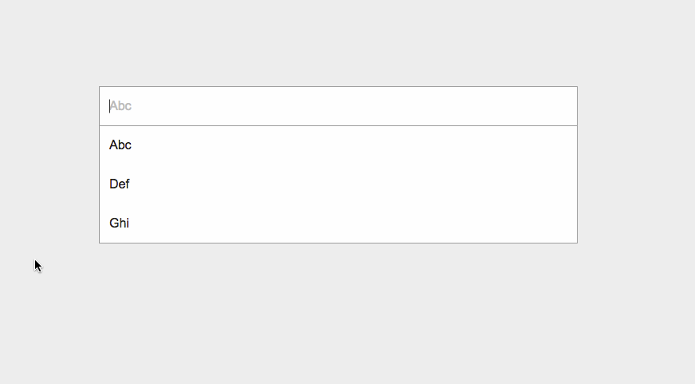

# Magic Box
[](https://travis-ci.org/coveo/magicbox)

> A search box on steroid

## Preview
Magic Box allows to create a search box designed to show auto completions based on a grammar.

It works by first declaring a grammar, then specifying a function to provide suggestions.

It will display shadow text as well as allow to navigate using keyboard



## Initialization
See demo.html for examples

    // The magic box must be initialized on a div, not directly on an input. This is for styling purpose (shadow text)
    var divToInitializeOn = document.getElementById('myMagicBox');
    
    // Use an existing grammar, or build your own.
    var grammarToUse = Coveo.MagicBox.Grammars.Basic;
    
    // provide options
    var options = {
        suggestionTimeout: 500
    }
    
    var magicbox = new Coveo.MagicBox.create(divToInitializeOn, grammarToUse, options);

###Possible options
* `inline: boolean;`<br/>
Specify if the suggestions should push the content of the page downward, or if the suggestions should appear over the content of the page<br/>
Default to false
* `selectableSuggestionClass: string;`<br/>
Specify the css class that should be generated for suggestion that can be selected.<br/>
Default is `magic-box-suggestion`
* `selectedSuggestionClass: string;`<br/>
Specify the css class that should be generated for a suggestion that is currently selected.<br/>
Default is `magic-box-selected`
* `suggestionTimeout?: number;`<br/>
Specify the timer before a suggestions is rejected for taking too long.<br/>
Default is `500` (ms)

##Provide suggestions
See demo.html for examples

    // You simply need to provide a function on getSuggestions
    // This function need to return an array of es6 compliant Promise.
    // Resolve those promise with an array of MagicBox.Suggestion
    var magicBox = new Coveo.MagicBox.create( [ .... ])
    
    magicBox.getSuggestions = function() {
        var ret = [];
        ret.push(new Promise(function(resolve, reject){
            var text = magicBox.getText();
            $.get('http://someservice.com?q=' + text)
            .done(function(data){
                // Here, be sure to resolve with an array of MagicBox.Suggestion
                resolve([{
                    text : data
                },{
                    text: 'another suggestion',
                    separator: 'Yep this is a static suggestion'
                }])
            })
            .fail(function(){
                reject()
            })
        })
        
        return ret;
    }
###MagicBox.Suggestion
* `text: string;`<br/>
OPTIONAL<br/>
Simple text content for a suggestion, will be displayed as is in the magic box.<br/>
eg : 'text': 'foobar'
* `html: string;`<br/>
OPTIONAL<br/>
Any valid HTML content for a suggestion, as a string.<br/>
eg: `'html': '<div class='some-class'><pre>foobar</pre></div>'`
* `dom: HTMLElement;`<br/>
OPTIONAL<br/>
Any valid HTML content for a suggestion, as an HTMLElement.<br/>
eg: `'dom': document.createElement('div')`
* `separator: string;`<br/>
OPTIONAL<br/>
A string to display at the end of this suggestion.<br/>
eg: `'separator': 'This is a separator'`
* `onSelect: function;`<br/>
OPTIONAL<br/>
A function to execute when this suggestion is selected by the end user.<br/>
eg: `'onSelect': function() { doSomething(); }`
* `index: number;`<br/>
OPTIONAL<br/>
Allows to sort all the suggestions in the order you wish. Higher index means rendered first.<br/>
eg: `'index': 999`

## Grammar
```
new Grammar('Start', {
    Start: ...,
    ...
})
```
## Expression
### RegExp Expression
```
/myRegex/
```
### Options Expression
```
['Option1', 'Option2', 'Option3']
```
### Ref Expression
Those can be add to the List Expression

#### Once
```
[referance]
```

#### Optionnal
```
[referance?]
```

#### Zero or many time
```
[referance*]
```

#### One or many time
```
[referance+]
```

### List Expression
```
"constant [ref]"
```

### Function Expression
IF YOU ARE NOT SURE IF YOU NEED THIS, YOU DON'T
```
(input: string, end: boolean, grammar:Grammar)=>Result
```